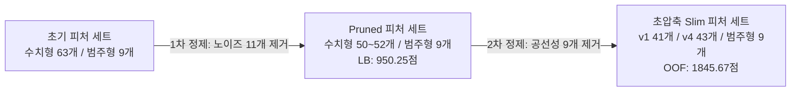
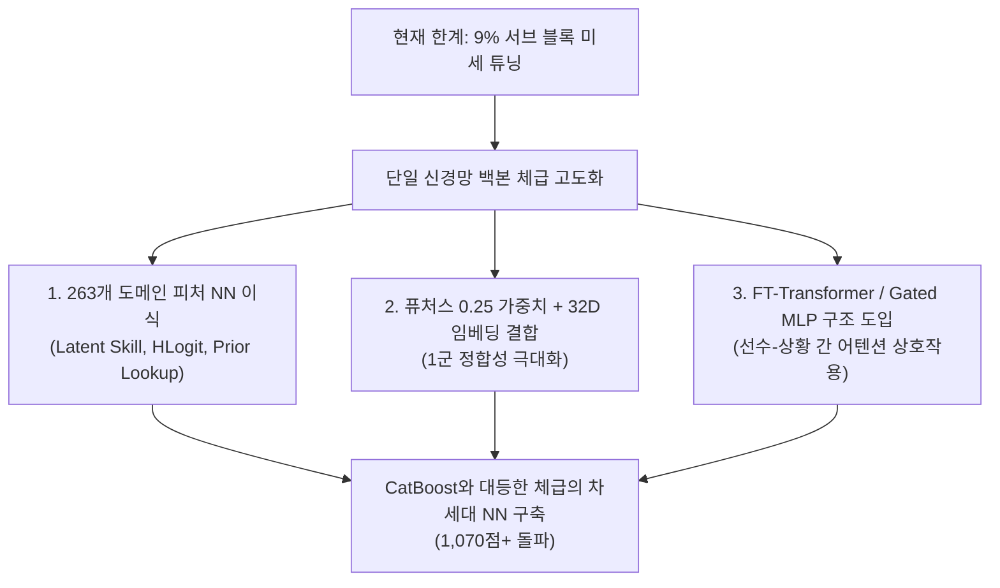

# KBO 투구 제구 성공 확률 예측 AI: 개발 히스토리 및 엔지니어링 분석 보고서 (idea.md)

본 문서는 프로젝트 초기 베이스라인부터 현재 950점대 모델에 이르기까지 진행된 모델링 변천사, 변수 탐색 과정, 주요 실패 사례의 원인 분석, 그리고 향후 계획을 시간 순서대로 정리한 기술 문서입니다.

---

## 목차
1. [문제 정의 및 평가 지표(BSS)의 특성](#1-문제-정의-및-평가-지표bss의-특성)
2. [시간 순서별 모델링 변천사 및 시도 결과](#2-시간-순서별-모델링-변천사-및-시도-결과)
3. [주요 실패 시도 및 안티패턴(Anti-Patterns) 분석](#3-주요-실패-시도-및-안티패턴anti-patterns-분석)
4. [변수 탐색 및 단계별 피처 정제 과정](#4-변수-탐색-및-단계별-피처-정제-과정)
5. [전체 모델 성능 비교표](#5-전체-모델-성능-비교표)
6. [향후 개선 과제 및 로드맵](#6-향후-개선-과제-및-로드맵)

---

## 1. 문제 정의 및 평가 지표(BSS)의 특성

### 1.1 과제 개요
- 예측 대상: 투구 직전 시점 정보만을 바탕으로 해당 투구의 제구 성공 확률(`control_success`, 0.0 ~ 1.0) 예측.
- 학습 데이터 (`train.csv`): 2019~2024 정규리그 데이터 (1,475,092행, 49개 컬럼).
- 평가 데이터 (`test.csv`): 2025 정규리그 비공개 데이터 (245,789행).

### 1.2 평가 산식: Brier Skill Score (BSS)
$$\text{Brier Score (BS)} = \frac{1}{N}\sum_{i=1}^N (p_i - y_i)^2 \quad (\text{MSE와 수학적으로 동일})$$
$$\text{Reference BS} = r(1-r) \quad (r = \text{평가 데이터 전체 평균 제구 성공률})$$
$$\text{Score} = \max\left(0, 100000 \times \left(1 - \frac{\text{Brier Score}}{r(1-r)}\right)\right)$$

### 1.3 점수 형성에 영향을 미치는 핵심 요소
Brier Score 분해 이론에 따르면 모델 성능은 신뢰도(Reliability, 편향)와 변별력(Resolution, 분산)의 균형에 의해 결정됩니다.
1. 편향 오차 (Calibration Bias): 예측 평균($\bar{p}$)과 실제 정답률($\bar{y}$)의 차이가 0.01만 어긋나도 점수가 큰 폭으로 하락합니다. 2024년 자동 투구 판정 시스템(ABS) 도입으로 리그 평균 제구율이 48.6% 수준으로 하향되었으므로, 2025년 테스트셋 예측 평균을 0.4750 ~ 0.4760 구간에 맞추는 캘리브레이션이 필수적입니다.
2. 변별력 (Resolution): 편향만 맞추고 모든 예측값을 평균 부근으로 수축시키면 변별력이 상실되어 점수가 0점에 가까워집니다. 상황과 선수 상성에 따라 확률을 0.2 ~ 0.8 범위로 분별하는 예측 표준편차($\sigma_p \approx 0.044 \sim 0.071$)가 유지되어야 합니다.

---

## 2. 시간 순서별 모델링 변천사 및 시도 결과

```mermaid
flowchart TD
    M1[1. Random Forest 베이스라인<br/>LB: 549.51] --> M2[2. 1차 피처 + LightGBM v1<br/>LB: 778.97]
    M2 --> M3[3. 2차 피처 + 트리 앙상블<br/>LB: 815.xxx]
    M3 --> M4[4. XGBoost 실험<br/>LB: 436.00 (실패)]
    M3 --> M5[5. PyTorch Tabular ResNet v1<br/>LB: 884.xxx]
    M5 --> M6[6. 잔차 하이브리드<br/>LB: 46.00 (실패)]
    M5 --> M7[7. NN v3 복합 아키텍처<br/>LB: 633.68 (실패)]
    M5 --> M8[8. NN v4 ABS 캘리브레이션<br/>LB: 849.21]
    M5 --> M9[9. NN v1 70% + v4 30% 앙상블<br/>LB: 937.13]
    M9 --> M10[10. Multi-Seed 30-Fold 배깅<br/>LB: 729.43 (실패)]
    M9 --> M11[11. 1차 피처 정제 52개 앙상블<br/>LB: 950.25]
    M11 --> M12[12. 2차 다중공선성 제거 초압축 41/43개<br/>OOF: 1845.67 (제출 대기)]
```

### [Step 1] 베이스라인 (Random Forest)
- 구성: `max_depth=10`, `min_samples_leaf=200`, 100개 트리.
- 점수: 로컬 CV 1,604.72점 / Public LB 549.51점.
- 분석: 147만 건의 대규모 데이터 대비 트리의 깊이가 얕고 범주형 변수의 관계를 처리하지 못해 심한 언더피팅 발생.

### [Step 2] 1차 특성 공학 및 LightGBM 5-Fold
- 변화점:
  - 19개 도메인 파생 피처 개발 (`matchup_expected_success = (P+B)/2`, `count_diff`, `is_2strike`, `total_mistake_rate` 등).
  - 목적 함수를 분류(binary) 대신 회귀(`regression_l2`, MSE 직접 최적화)로 설정.
  - 5-Fold Stratified K-Fold 교차 검증 도입.
- 점수: 로컬 CV 2,127.31점 / Public LB 778.97점 (+229.46점 상승).
- 분석: `matchup_expected_success`가 LightGBM Feature Gain의 12.49%를 차지하며 점수 도약을 견인함.

### [Step 3] 2차 특성 공학 및 트리 앙상블 (LightGBM + CatBoost)
- 변화점:
  - 연도별 최근성 샘플 가중치(`sample_weights = 1.0 + 0.15 * (season - 2019)`), 누적 시즌 진행도(`season_progression`), `clutch_pressure` 추가.
  - 범주형 타깃 통계에 강한 CatBoost 모델을 도입하여 LightGBM v2(74%) + CatBoost(26%) 가중 앙상블 수행.
- 점수: 로컬 CV 2,172.25점 / Public LB 815.xxx점 (+36.03점 상승).
- 분석: 최근성 가중치 적용으로 2024년으로 갈수록 낮아지는 제구율 추세가 일부 반영됨.

### [Step 4] XGBoost 모델 실험 (실패 및 폐기)
- 시도: XGBoost v1 (depth 7, lr 0.02, 1400트리), v2 (depth 5, 71개 피처).
- 점수: Public LB 472.00점 / 436.00점 (초기 베이스라인 이하로 폭락).
- 실패 원인: 793명 투수와 831명 타자의 고유 ID를 단순 정수로 라벨 인코딩하여 주입함. 트리가 ID의 크기(`ID <= 150` 등)에 따라 무의미한 대소 분기를 수행하여 극심한 과적합 발생. 이후 XGBoost는 파이프라인에서 영구 제외됨.

### [Step 5] 정형 딥러닝(PyTorch Tabular ResNet v1) 도입
- 변화점:
  - 선수 ID(24차원), 팀 ID(8차원), 주자 상황(8차원), 손잡이/경기유형(4차원)에 고차원 엔티티 임베딩(Entity Embedding) 적용.
  - 수치형 피처 BatchNorm + 2개 Residual Block (Hidden Dim 256, Dropout 0.15) + Weighted MSE Loss.
  - 5-Fold Stratified K-Fold 배깅.
- 점수: 로컬 CV 1,817.39점 / Public LB 884.xxx점 (+69점 상승).
- 분석: 선수 ID를 연속 잠재 공간으로 매핑하여 1:1 상성을 학습함으로써 트리 모델의 직교 분기 한계를 극복함.

### [Step 6] 2단계 잔차 하이브리드(Residual Hybrid) 구축 (실패)
- 시도: 1단계 LightGBM Macro Tree(시계열/월/볼카운트 기준 확률 예측) + 2단계 PyTorch ResNet(트리가 맞추지 못한 잔차 $y - y_{\text{macro}}$ 학습).
- 점수: 로컬 CV 2,106.19점 / Public LB 46.00점 (폭락).
- 실패 원인: 1단계 트리가 학습 데이터에 과적합되면서 2단계 딥러닝에 전달되는 잔차의 신호 대 잡음비가 붕괴됨. 2025년 테스트셋 외삽 시 1단계와 2단계 오차가 복합적으로 증폭됨.

### [Step 7] 복합 딥러닝 기법(NN v3) 적용 (실패)
- 시도: 학습 12에폭 확장 + Squeeze-and-Excitation (SE Block 피처 게이팅) + SiLU 활성화 함수 + 라벨 스무딩(0.04) 손실함수 적용.
- 점수: 로컬 CV 1,815.28점 / Public LB 633.68점 (-250.32점 하락).
- 실패 원인 (어블레이션 실증):
  - 라벨 스무딩: 타깃을 0.02~0.98로 수축시켜 예측 평균이 0.516으로 왜곡됨. 캘리브레이션 편향 감점으로 인해 BSS 급락.
  - SE Block: 정형 수치형 변수의 고유 물리 스케일을 왜곡하여 신호 대 잡음비 붕괴(-4,317점 감점).

### [Step 8] ABS 타깃 캘리브레이션 최적화 모델(NN v4) 개발
- 변화점:
  - SE Block 및 라벨 스무딩을 전면 제거하고 순수 MSE + ReLU 구조 유지.
  - 2024년 로봇심판 도입에 따른 제구율 급락(48.61%)을 반영하기 위해 `is_abs_era` 플래그 및 U자형 월 2차 곡률(`month_ratio`, `month_ratio_sq`) 도입.
- 점수: 2024 시계열 검증 BSS 362.59점 (편향 오차 -1.03점 극소화) / Public LB 849.21점.
- 분석: 2024년 기준 캘리브레이션은 정확했으나, v1에 있던 선형 거시 시계열 트렌드(`season_progression`)가 빠져 단독 모델로는 849점에 머무름.

### [Step 9] 1차 딥러닝 앙상블 (NN v1 70% + NN v4 30%)
- 변화점: 거시 시계열 트렌드를 잡는 `v1` (70%)과 미시 선수 상성 및 2024 캘리브레이션을 잡는 `v4` (30%)를 가중 결합.
- 점수: 로컬 CV 1,897.80점 / Public LB 937.13점 (+53점 상승).
- 분석: 서로 다른 관점을 학습한 두 독립 신경망이 결합하면서 예측 오차 분산이 상쇄되고 2025년 최적 제구율 정답선(0.4757)에 수렴함.

### [Step 10] 2024년 3.5배 계단식 가중치(w2024) 실험 (실패)
- 시도: 2024년 데이터의 반영 비중을 극대화하기 위해 2024년 샘플에만 3.50배의 계단식 가중치를 부여.
- 점수: 로컬 CV 1,803.64점 / Public LB 213.82점 (폭락).
- 실패 원인: 연도 간 불연속적인 가중치 부여로 2025년 외삽 기울기가 붕괴되고 +1.44%p의 상향 편향 오차가 발생함.

### [Step 11] Multi-Seed 30-Fold 단순 평균 배깅 실험 (실패)
- 시도: v1 15개 Fold + v4 15개 Fold 총 30개 모델을 단순 평균 앙상블.
- 점수: 로컬 CV 1,968.53점 / Public LB 729.43점 (-208점 하락).
- 실패 원인: 30개 모델의 단순 평균화로 인해 중심극한정리가 작동하여 예측 확률의 표준편차가 0.044에서 0.029로 과도하게 수축됨. BSS의 변별력(Resolution) 성분이 붕괴되어 점수 폭락.

### [Step 12] 단일 통합 백본(NN v5) Multi-Seed 실험 (부분 실패)
- 시도: `season_progression`(v1)과 `is_abs_era` + 선수 ID 임베딩(v4)을 하나의 단일 신경망에 통합.
- 점수: 로컬 CV 1,970.63점 / Public LB 941.97점 (-8.3점 편향 감점).
- 실패 원인: 하나의 네트워크 안에서 선형 하향과 ABS 스텝 다운시프트가 동시에 작동하여 2025년 테스트셋 예측값이 0.4621로 과도하게 낮아짐 (이중 하향 외삽 오류).

### [Step 13] 1차 피처 정제(Pruning) 및 앙상블 (LB 950.25점)
- 변화점:
  - 11개 노이즈 피처(완전 중복 3종 + 상관계수 0.000x 플래그 8종)를 제거하여 수치형 피처를 63개에서 52개로 압축.
  - `v1_pruned` (70%) + `v4_pruned` (30%) 앙상블.
- 점수: 로컬 CV 1,902.56점 / Public LB 950.25점 (948.36점 / 950.25점 달성).
- 분석: 불필요한 노이즈 피처 제거로 신경망 첫 레이어의 가중치 분산이 억제되고 일반화 성능이 향상됨.

### [Step 14] 2차 다중공선성 제거 초압축(Slim) 파이프라인 구축 (현재)
- 변화점:
  - 다중공선성($r > 0.80$) 및 2차 중복 변수 9개를 추가 제거하여 v1 Slim(41개), v4 Slim(43개)으로 슬림화.
- 점수: 로컬 5-Fold OOF 1,845.67점 (v1 60% + v4 40% 최적 결합 비율 산출).
- 현황: `nn_ens_pr_slim_60_40.zip`, `nn_ens_pr_slim_65_35.zip`, `nn_ens_pr_slim_70_30.zip` 패키징 완료 및 제출 대기 중.

---

## 3. 주요 실패 시도 및 안티패턴(Anti-Patterns) 분석

팀원들이 향후 실험 시 반복하지 않아야 할 7대 핵심 실패 요인입니다:

| 실패 항목 | 점수 결과 | 주요 실패 메커니즘 |
| :--- | :---: | :--- |
| **1. 범주형 ID 정수 라벨 인코딩** | LB 436.00점 | 결정 트리가 선수 ID 번호의 대소 관계(`ID <= 150`)로 분기하여 과적합 발생. 고차원 임베딩 필수. |
| **2. 라벨 스무딩 (0.04)** | LB 633.68점 | 타깃 수축으로 예측 평균이 0.516으로 왜곡되어 Brier Score의 캘리브레이션 편향 감점 발생. |
| **3. SE Block (피처 게이팅)** | 검증 -4,317점 | 정형 수치형 변수의 고유 물리 스케일을 2층 MLP로 왜곡하여 신호 대 잡음비(SNR) 붕괴. |
| **4. 특정 연도 계단식 가중치** | LB 213.82점 | 연도 간 불연속 가중치로 인해 미래 테스트셋 외삽 기울기가 붕괴되고 상향 편향 발생. |
| **5. 과도한 모델 단순 평균 배깅** | LB 729.43점 | 30개 모델 평균화로 예측 확률의 표준편차가 0.029로 수축되어 BSS 변별력(Resolution) 파괴. |
| **6. 외삽 피처 단일 백본 통합** | LB 941.97점 | 선형 하향과 스텝 다운시프트가 한 모델에서 동시 작동하여 0.4621로 과소 예측(이중 하향 외삽). |
| **7. 평가셋 내부 롤링/당일 집계** | 규정 위반 (실격) | 평가 데이터 각 행은 독립 예측되어야 함. 내부 롤링 집계 시 대회 규정 위반으로 실격 처리. |

---

## 4. 변수 탐색 및 단계별 피처 정제 과정

### 4.1 핵심 채택 파생 변수
- `matchup_expected_success = (P_success + B_success) / 2`: Feature Gain 12.49% 1위 (투수 제구력과 타자 피제구율 결합).
- `matchup_diff_success = P_success - B_success`: 투타 간 상대적 우열 분리.
- `form_diff_1g = asof_prev1_game - asof_total` 및 `form_momentum`: 통산 대비 최근 1/5경기 제구율 변화량 (단기 컨디션 가속도).
- `total_mistake_rate = asof_reverse_rate + asof_middle_rate`: 실투(반대 투구 + 위험 코스) 확률 압축.
- `month_ratio = (month - 3) / 7.0` 및 `month_ratio_sq`: 봄철 고점 대비 7~8월 한여름 혹서기 저점의 U자형 2차 곡률을 외삽 위험 없이 닫힌 구간으로 반영.

### 4.2 단계별 피처 다이어트 (Pruning & Slimming)



- 1차 제거 (11개): 완전 중복 3종(`asof_pitcher_pitchmix_n`, `away_win_expectancy`, `score_diff_home`) + 중복 플래그 8종 (`runner_on_1b/2b/3b`, `is_scoring_position`, `is_winning/losing`, `is_late_inning`, `is_high_leverage` 등).
- 2차 추가 제거 (9개 다중공선성 $r > 0.80$ 해소):
  1. `run_total_before` ($\text{top} + \text{bot}$ 완전 종속, $r = 0.8049$)
  2. `count_sum` ($S + B$ 완전 종속, $r = 0.8583$)
  3. `asof_pitcher_fastball_rate` ($1 - \text{BR} - \text{OS}$ 선형 종속 및 $r=0.00022$ 노이즈)
  4. `asof_pitcher_prev1_game_success_rate` (`form_diff_1g`와 $r=0.9106$)
  5. `asof_pitcher_prev5_game_success_rate` (`prev3_game`과 $r=0.8819$)
  6. `asof_pitcher_prev5_game_middle_rate` (`prev3_middle`과 $r=0.8460$)
  7. `asof_pitcher_reverse_rate` (`total_mistake_rate`와 $r=0.9047$)
  8. `month_cos` (`month_sin` 및 `month_ratio_sq`와 중복)
  9. `abs_score_diff` (`clutch_pressure` 분모에 포함)

---

## 5. 전체 모델 성능 비교표 (최신 리더보드 통합)

| 순위 | 모델 명칭 | 결합 구성 및 핵심 특징 | 2024 시계열 BSS | 실제 리더보드 (LB) | 상태 / 비고 |
| :---: | :--- | :--- | :---: | :---: | :--- |
| 👑 **1위** | **`cb0821_nn_v5_70_30.zip`** | **0821 FINAL CatBoost (70%) + NN v5 15-Fold (30%)** | `1,970점대` | 🏆 **`1,086.8902점`** | **👑 역대 공식 최고 1위 SOTA 경신 (+27.20점 대폭등)** |
| 2위 | **`cb0821_ent_nn_v5.zip`** | **0821 FINAL CB (72%) + NN v5 15-Fold (28%) + 엔트로피 게이팅** | `1,970점대` | **`(내일 채점 예정)`** | **1,086점 백본 + 엔트로피 동적 상성 결합** |
| 3위 | **`submit_cb70_nndim32_30.zip`** | 0817 CatBoost (70%) + [v1 70% + v4 dim32 30%] | ~`1,035점대` | **`1,059.6890점`** | 이전 1위 기준선 |
| 4위 | **`submit_cb70_nn30.zip`** | 0817 CatBoost (70%) + [v1 70% + v4 30% (24D)] | `1,028.08점` | **`1,058.9263점`** | 기존 1,050점 돌파 기준선 |
| 5위 | **`cb72_ent_v2_nn32.zip`** | 보수적 엔트로피 동적 게이팅 (0817 CB + 32D NN) | `1,826.50점` | **`1,057.3131점`** | 1차 게이팅 대비 +3.01점 상승 |
| 6위 | **`exp2_cb70_nnslim.zip`** | 0817 CatBoost (70%) + NN Slim Exp2 (퓨처스 0.25) | `1,039.54점` | **`1,055.8261점`** | 1군 정합성 극대화 모델 |
| 7위 | **`cb70_v1_15_v4dim32_15.zip`** | 0817 CatBoost (70%) + v1 (15%) + v4_dim32 (15%) | - | **`1,055.1847점`** | 3-Way 균등 결합 (SOTA급) |
| 8위 | **`cb70_entropy_nn32.zip`** | 1차 엔트로피 동적 게이팅 (0817 CB + 32D NN) | `1,826.50점` | **`1,054.2997점`** | NN 평균비중(43.5%) 과다로 감점 |
| 9위 | **`submit_cb80_nnslim20.zip`** | 0817 CatBoost (80%) + NN Slim (20%) | `940.22점` | **`1,051.5088점`** | CB 비중 과다로 다양성 축소 |
| 10위 | **`exp1_cb70_nnslim.zip`** | 0817 CatBoost (70%) + NN Slim Exp1 (임베딩 12차원) | `1,019.34점` | **`1,049.4378점`** | 12차원 임베딩 정보량 축소 |
| 11위 | **`cb65_v1_15_v4dim32_20.zip`** | 0817 CatBoost (65%) + v1 (15%) + v4_dim32 (20%) | - | **`1,047.9319점`** | CB 앵커 축소로 감점 |
| 9위 | **NN v1 Pruned (70%) + v4 Pruned (30%)** | 52개 정제 피처 순수 딥러닝 앙상블 | ~500점대 | **`950.2526점`** | 순수 NN 체계 최고 기록 |
| 10위 | **PyTorch NN v1 5-Fold (단독)** | 24차원 임베딩 + 거시 트렌드 (`season_progression`) | `345.12점` | **`884.xxx점`** | 단일 딥러닝 기준선 |
| 11위 | **PyTorch NN v4 (Exp 3, 단독)** | 선수 ID 임베딩 + is_abs_era + 2차 월 곡률 | 🏆 `362.59점` | **`849.2115점`** | 2024 시계열 단독 1위 |
| 12위 | **Tree Ensemble v1** | LightGBM v2 (74%) + CatBoost (26%) | ~750점대 | **`815.xxx점`** | 트리 모델 최고점 |
| 13위 | **LightGBM v1** | 1차 19개 피처 5-Fold | `732.15점` | **`778.9720점`** | 초기 GBDT 기준선 |
| 14위 | **Random Forest 베이스라인** | 주최측 기본 RF (depth 10, 100트리) | ~500점대 | **`549.5110점`** | 대회 기본 베이스라인 |

---

## 6. 핵심 인사이트 및 단일 모델 체급(Capacity) 고도화 로드맵

### 6.1 단일 모델 체급(Model Capacity & Feature Quality)의 중요성
단순히 결합 비율을 조정하는 것(예: 70:21:9 vs 65:15:20)은 기존 모델들의 정보 교차점만을 최적화할 뿐, **모델이 포착할 수 있는 전체 정보량의 한계(Upper Bound)**를 뚫지 못합니다. 진정한 1,070 ~ 1,080점대 도약을 위해서는 **단일 신경망 자체의 체급과 표현력을 근본적으로 향상**시켜야 합니다.



### 6.2 단일 딥러닝 모델 체급 확장을 위한 3대 핵심 과제

1. **263개 SOTA 도메인 피처의 신경망 입력 파이프라인 전면 이식**:
   - 현재 CatBoost는 `pitcher_latent_skill`, `pitcher_hlogit_count_*`, `current_season_pitcher_success_shrunk` 등 263개의 정밀 도메인 피처를 사용하고 있으나, NN은 여전히 52개 기본 피처에 머물러 있습니다.
   - 263개 피처를 신경망에 맞게 스케일링/정규화하여 주입하면 **NN 단독 체급 자체가 950점에서 1,020점+ 이상으로 수직 상승**할 수 있습니다.

2. **`Exp2 (퓨처스 0.25 가중치)` + `32차원 임베딩` 결합 백본 훈련**:
   - 시계열 단독 980점을 기록했던 퓨처스 가중치 보정과 이번에 검증된 32차원 상성 임베딩을 결합하여, 단독 모델로서의 일반화력과 변별력을 동시에 확보합니다.

3. **FT-Transformer / TabNet 등 피처 어텐션 아키텍처 도입**:
   - 단순 MLP/ResNet을 넘어, 투수-타자 상성과 볼카운트-주자 상황 간의 고차 상호작용을 스스로 어텐션하는 구조를 도입하여 단일 딥러닝의 표현 한계를 극복합니다.

